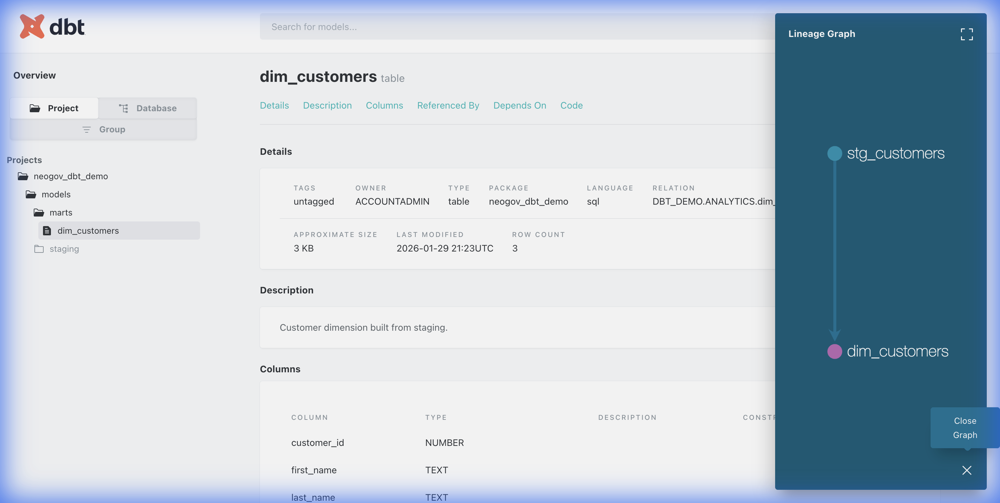

# dbt + Snowflake Demo

A sample dbt project demonstrating data transformation pipelines with Snowflake, featuring staging and mart models, data quality tests, and auto-generated documentation.

## Project Structure

```
dbt_sf/
├── dbt_project.yml           # Project configuration
└── models/
    ├── schema.yml            # Model documentation & tests
    ├── staging/
    │   └── stg_customers.sql # Staging view - cleans raw data
    └── marts/
        └── dim_customers.sql # Mart table - customer dimension
```

## Models

| Model | Type | Description |
|-------|------|-------------|
| `stg_customers` | View | Staging layer - cleans and standardizes raw customer data |
| `dim_customers` | Table | Mart layer - customer dimension with derived `full_name` field |

## Source Tables

| Database | Schema | Table | Description |
|----------|--------|-------|-------------|
| `DBT_DEMO` | `RAW` | `CUSTOMERS_RAW` | Raw customer data ingested from source systems |

**Columns:**
- `CUSTOMER_ID` (NUMBER) - Primary key
- `FIRST_NAME` (STRING)
- `LAST_NAME` (STRING)
- `EMAIL` (STRING)
- `CREATED_AT` (TIMESTAMP_NTZ)

## Target Objects

| Database | Schema | Object | Type | Description |
|----------|--------|--------|------|-------------|
| `DBT_DEMO` | `ANALYTICS` | `STG_CUSTOMERS` | View | Cleaned staging data |
| `DBT_DEMO` | `ANALYTICS` | `DIM_CUSTOMERS` | Table | Customer dimension with `full_name` |

## Data Quality Tests

- `customer_id`: not_null, unique (both models)
- `email`: not_null (staging model)

## Setup

### Prerequisites
- Python 3.9+
- Snowflake account

### Installation

```bash
# Create virtual environment
python3 -m venv dbt-venv
source dbt-venv/bin/activate

# Install dbt
pip install dbt-snowflake
```

### Configure Snowflake Connection

Create `~/.dbt/profiles.yml`:

```yaml
dbt_sf:
  target: dev
  outputs:
    dev:
      type: snowflake
      account: "YOUR_ACCOUNT"
      user: "YOUR_USER"
      password: "YOUR_PASSWORD"
      role: "SYSADMIN"
      database: "DBT_DEMO"
      warehouse: "DBT_WH"
      schema: "ANALYTICS"
      threads: 4
```

### Run Snowflake Setup SQL

```sql
CREATE WAREHOUSE IF NOT EXISTS DBT_WH WAREHOUSE_SIZE = 'XSMALL' AUTO_SUSPEND = 60 AUTO_RESUME = TRUE;
CREATE DATABASE IF NOT EXISTS DBT_DEMO;
CREATE SCHEMA IF NOT EXISTS DBT_DEMO.RAW;
CREATE SCHEMA IF NOT EXISTS DBT_DEMO.ANALYTICS;

CREATE OR REPLACE TABLE DBT_DEMO.RAW.CUSTOMERS_RAW (
  CUSTOMER_ID NUMBER,
  FIRST_NAME STRING,
  LAST_NAME STRING,
  EMAIL STRING,
  CREATED_AT TIMESTAMP_NTZ
);

INSERT INTO DBT_DEMO.RAW.CUSTOMERS_RAW VALUES
(1, 'Ava', 'Patel', 'ava.patel@example.com', CURRENT_TIMESTAMP()),
(2, 'Noah', 'Kim', 'noah.kim@example.com', CURRENT_TIMESTAMP()),
(3, 'Mia', 'Lopez', 'mia.lopez@example.com', CURRENT_TIMESTAMP());
```

## Usage

```bash
cd dbt_sf

# Verify connection
dbt debug

# Run models
dbt run

# Run tests
dbt test

# Generate documentation
dbt docs generate
dbt docs serve
```

## Lineage



## Technologies

- **dbt** - Data transformation framework
- **Snowflake** - Cloud data warehouse
- **SQL** - Transformation logic
