# dbt + Snowflake Setup Guide

A comprehensive step-by-step guide for installing dbt and integrating with Snowflake.

---

## Architecture Overview


---

## Data Flow

```mermaid
flowchart TD
    A["📥 RAW.CUSTOMERS_RAW<br/>(Source Table)"] --> B["🔄 stg_customers<br/>(Staging View)"]
    B --> C["📊 dim_customers<br/>(Mart Table)"]
    
    style A fill:#ff6b6b,color:#fff
    style B fill:#4ecdc4,color:#fff
    style C fill:#45b7d1,color:#fff
```



---

## Step 1: Create Snowflake Account

### 1.1 Sign Up
1. Go to [signup.snowflake.com](https://signup.snowflake.com/)
2. Choose **Enterprise** edition (free trial)
3. Select your cloud provider (AWS, Azure, or GCP)
4. Complete registration

### 1.2 Get Account Details
After login, click your profile icon → **Account Details**:

| Field | Example | Description |
|-------|---------|-------------|
| Account Identifier | `ABC12345-XY67890` | Used in profiles.yml |
| Login Name | `YOUR_USERNAME` | Your username |
| Role | `ACCOUNTADMIN` | Admin role for demo |

---

## Step 2: Set Up Snowflake Objects

Run this SQL in **Snowflake Worksheets**:

```sql
-- 1. Create Warehouse (compute resource)
CREATE WAREHOUSE IF NOT EXISTS DBT_WH
  WAREHOUSE_SIZE = 'XSMALL'
  AUTO_SUSPEND = 60
  AUTO_RESUME = TRUE;

-- 2. Create Database
CREATE DATABASE IF NOT EXISTS DBT_DEMO;

-- 3. Create Schemas
CREATE SCHEMA IF NOT EXISTS DBT_DEMO.RAW;        -- Source data
CREATE SCHEMA IF NOT EXISTS DBT_DEMO.ANALYTICS;  -- dbt output

-- 4. Create Source Table
CREATE OR REPLACE TABLE DBT_DEMO.RAW.CUSTOMERS_RAW (
  CUSTOMER_ID NUMBER,
  FIRST_NAME STRING,
  LAST_NAME STRING,
  EMAIL STRING,
  CREATED_AT TIMESTAMP_NTZ
);

-- 5. Insert Sample Data
INSERT INTO DBT_DEMO.RAW.CUSTOMERS_RAW VALUES
(1, 'Ava', 'Patel', 'ava.patel@example.com', CURRENT_TIMESTAMP()),
(2, 'Noah', 'Kim', 'noah.kim@example.com', CURRENT_TIMESTAMP()),
(3, 'Mia', 'Lopez', 'mia.lopez@example.com', CURRENT_TIMESTAMP());
```

### Snowflake Object Hierarchy

```mermaid
flowchart TD
    WH["🖥️ DBT_WH<br/>(Warehouse)"]
    DB["🗄️ DBT_DEMO<br/>(Database)"]
    RAW["📁 RAW<br/>(Schema)"]
    ANA["📁 ANALYTICS<br/>(Schema)"]
    TBL["📊 CUSTOMERS_RAW<br/>(Table)"]
    
    WH --> DB
    DB --> RAW
    DB --> ANA
    RAW --> TBL
```



---

## Step 3: Install dbt

### 3.1 Create Python Virtual Environment

```bash
# Navigate to project directory
cd /path/to/your/project

# Create virtual environment
python3 -m venv dbt-venv

# Activate it
source dbt-venv/bin/activate  # Mac/Linux
# dbt-venv\Scripts\activate   # Windows
```

### 3.2 Install dbt-snowflake

```bash
# Upgrade pip
pip install --upgrade pip

# Install dbt with Snowflake adapter
pip install dbt-snowflake

# Verify installation
dbt --version
```

Expected output:
```
Core:
  - installed: 1.x.x

Plugins:
  - snowflake: 1.x.x
```

---

## Step 4: Configure dbt Profile

### 4.1 Create profiles.yml

Create the file `~/.dbt/profiles.yml`:

```bash
mkdir -p ~/.dbt
```

Add this content (replace with your credentials):

```yaml
dbt_sf:
  target: dev
  outputs:
    dev:
      type: snowflake
      account: "YOUR_ACCOUNT_IDENTIFIER"  # e.g., ZAJOWGC-HQB87409
      user: "YOUR_USERNAME"               # e.g., DGSARU47
      password: "YOUR_PASSWORD"
      role: "ACCOUNTADMIN"
      database: "DBT_DEMO"
      warehouse: "DBT_WH"
      schema: "ANALYTICS"
      threads: 4
```

### 4.2 Profile Configuration Diagram


---

## Step 5: Create dbt Project

### 5.1 Project Structure

```
dbt_sf/
├── dbt_project.yml          # Project configuration
├── profiles.yml.template    # Credential template (for sharing)
└── models/
    ├── schema.yml           # Model documentation & tests
    ├── staging/
    │   └── stg_customers.sql    # Staging model (View)
    └── marts/
        └── dim_customers.sql    # Mart model (Table)
```

### 5.2 dbt_project.yml

```yaml
name: 'dbt_sf'
version: '1.0.0'
profile: 'dbt_sf'

model-paths: ["models"]

models:
  dbt_sf:
    staging:
      +materialized: view    # Staging = Views
    marts:
      +materialized: table   # Marts = Tables
```

### 5.3 Staging Model (stg_customers.sql)

```sql
with source as (
    select
        customer_id,
        first_name,
        last_name,
        email,
        created_at
    from DBT_DEMO.RAW.CUSTOMERS_RAW
)

select * from source
```

### 5.4 Mart Model (dim_customers.sql)

```sql
select
    customer_id,
    first_name,
    last_name,
    email,
    created_at,
    first_name || ' ' || last_name as full_name
from {{ ref('stg_customers') }}
```

> **Note:** `{{ ref() }}` creates a dependency between models

---

## Step 6: Run dbt

### 6.1 Verify Connection

```bash
cd dbt_sf
dbt debug
```

Expected output:
```
Connection test: [OK connection ok]
All checks passed!
```

### 6.2 Build Models

```bash
dbt run
```

### 6.3 Run Tests

```bash
dbt test
```

### 6.4 dbt Execution Flow


---

## Step 7: Generate Documentation

```bash
# Generate docs
dbt docs generate

# Serve locally (opens browser)
dbt docs serve --port 8080
```

This creates an interactive documentation site showing:
- Model descriptions
- Column definitions
- Data lineage graph
- Test results

---

## Quick Reference Commands

| Command | Description |
|---------|-------------|
| `dbt debug` | Test connection |
| `dbt run` | Build all models |
| `dbt run --select stg_customers` | Build specific model |
| `dbt test` | Run all tests |
| `dbt docs generate` | Generate documentation |
| `dbt docs serve` | View docs in browser |
| `dbt clean` | Remove compiled files |

---

## Troubleshooting

### Connection Errors

| Error | Solution |
|-------|----------|
| `Account not found` | Check account identifier format (include region) |
| `Incorrect username or password` | Verify credentials in profiles.yml |
| `Warehouse does not exist` | Run the CREATE WAREHOUSE SQL |
| `Database does not exist` | Run the CREATE DATABASE SQL |

### Common Issues


---

## Next Steps

1. **Add more models** - Create additional staging and mart models
2. **Add sources** - Define sources in `sources.yml` for better documentation
3. **Add custom tests** - Create business rule validations
4. **Set up CI/CD** - Automate dbt runs with GitHub Actions
5. **Explore incremental models** - For large datasets
